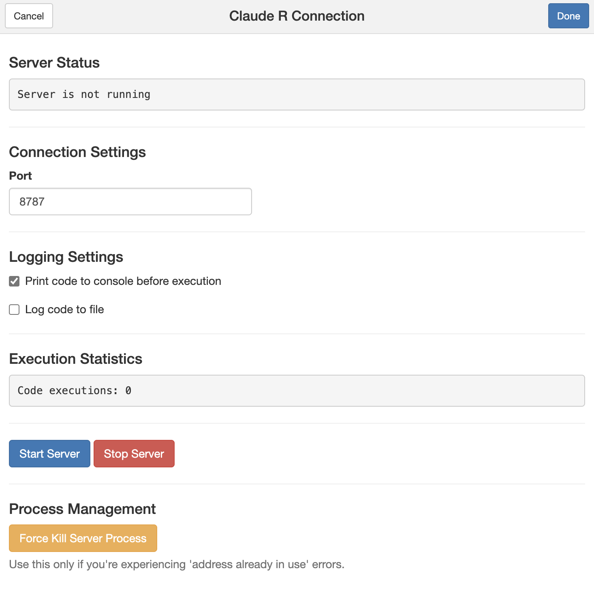
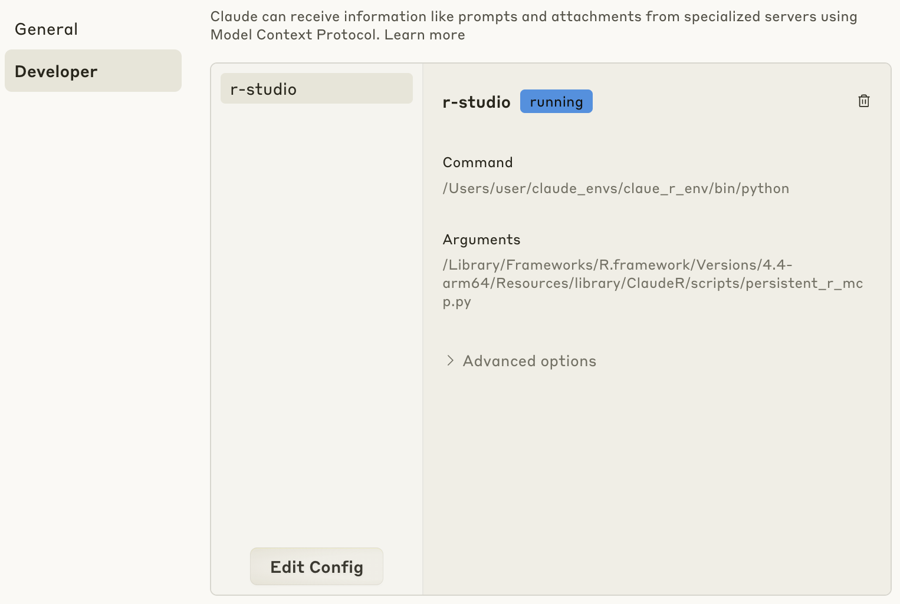
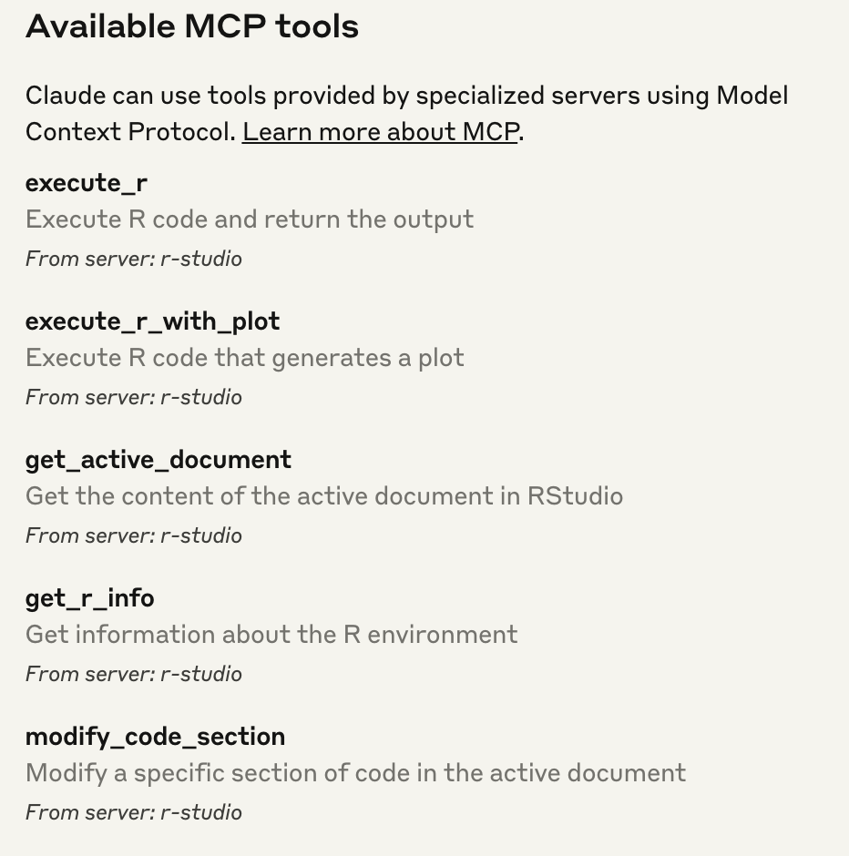
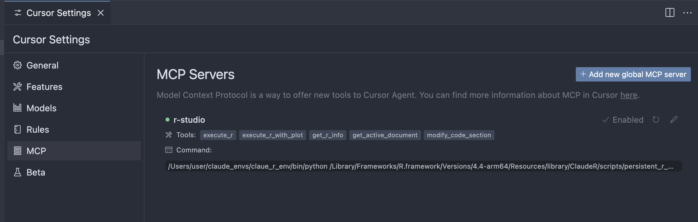
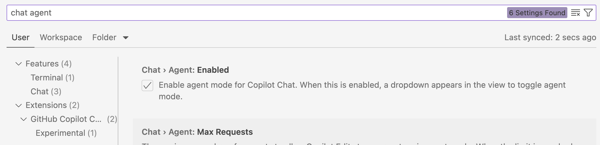
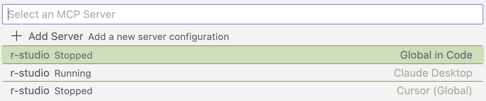

{fig-align="center"}

> "Never send a human to do a machine's job" - Agent Smith, *The Matrix (*1999)

# Intro

In this post, I provide a brief overview of the Model Context Protocol (MCP) and how to use it with Rstudio using the {ClaudeR} package. I share my initial thoughts on agentic programming with R using Claude, VS Code, and Cursor. This post is intended to be a short guide for my colleagues and others for getting started with using MCP in R/Rstudio. This is *not* a deep dive into MCP, agents, nor the {ClaudeR} package.

# Background: MCP and Agentic Programming

[The Model Context Protocol (MCP)](https://docs.anthropic.com/en/docs/agents-and-tools/mcp) is a recently developed software specification that standardizes the way large language models (LLMs) connect to existing software (e.g. RStudio). LLMs that support MCP can now operate tools or software applications as **Agents** to complete specific tasks autonomously!

## How does MCP impact programming and data analysis?

In order to understand how MCP impacts programming and data analysis, we need to understand how most programmers and data scientists (myself included) used LLMs before MCP. Traditionally, we would use LLMs to generate (or debug) code and then copy and run that code in our IDE (e.g. RStudio, Jupyter Lab, etc.). This process was often tedious and error-prone, as we had to manually fix any errors or typos in code that the LLM provided (e.g. incorrect args or object names). To help illustrate this further, below are two examples that contrast the two approaches to programming with LLMs before and after MCP.

### Before MCP: Procedural Programming with LLMs

-   You ask an LLM on perplexity/claude/chatgpt to help write and improve your code. You copy the revised code into your IDE after 'carefully' reviewing it. After running the code (hoping that it works), you then copy the outputs/errors from your IDE and paste them back to the LLM. You repeat this tedious process until you finish the specific task. For those with limited programming experience, this kind of process could take several iterations and require consistent feedback with the LLM. It's an imperfect process that is often frustrating and time-consuming.

### After MCP: Agentic Programming

-   LLMs can now act autonomously as Agents.

-   I ask the Agent to perform a task (e.g. create a scatterplot of the mtcars dataset) and it is able to perform the task autonomously with the right tool that is connected via an MCP server. Using {ClaudeR}, the Agent is made aware of the R objects, functions, and packages in the R environment in Rstudio. If there are any errors during a task, the Agent will automatically recognize them and revise its approach until the task is completed (or it encounters an error it cannot fix like a system issue or a connection timeout, more on this at the end).

# Getting Started with Agentic Programming in R

{fig-align="center"}

The following describes how to get started with agentic programming in R. First, we will install an R package that will setup an MCP server in an Rstudio application. Then, we will connect to that MCP server using Claude Desktop, VS Code, or Cursor.

Before moving forward, please be sure to ⭐️ the excellent [{ClaudeR} repo](https://github.com/IMNMV/ClaudeR) to show your support for the developer.

## Installing the {ClaudeR} package

The {ClaudeR} package is a wrapper for the MCP API that allows Agents to use Rstudio. As of today (April 15, 2025), it is the only R package that I am aware of that integrates Rstudio/Positron with MCP. I am betting that we will see more 'official' R packages from Posit or cynkra in the coming weeks that will provide additional ways to use MCP in Positron and specific R packages.

{ClaudeR} requires minimal R packages and two python modules to operate. To get started, follow these steps which are adapted from the {ClaudeR} README.

1.  Install the {ClaudeR} package from GitHub

```{r, eval = FALSE}
devtools::install_github("IMNMV/ClaudeR")
```

2.  Install Python dependencies

{ClaudeR} requires two python modules `mcp` and `httpx`. Before installing these, I highly recommend using `venv` or `conda` to create a virtual environment in your terminal. This will help avoid any conflicts with existing python packages, but this is not necessary

```{python, eval = FALSE}
# beforethis, you can also create a virtual or conda environment
pip install mcp httpx
```

3.  Start the MCP Server in Rstudio

To start the MCP Server in RStudio, {ClaudeR} provides a convenient Shiny interface that is demonstrated below. Prior to running this command, you can load other R packages and files that you want to expose to your Agent. After starting the server, your R console will be locked until the server is stopped.

*Note: This server runs on your local computer and communicates between applications, it does not send any data to the cloud or a remote server.*

```{r, eval = FALSE}
library(ClaudeR)

# Start the MCP server in Rstudio, a Shiny app will open in the Viewer pane
ClaudeR::claudeAddin()
```



After running the above function, you will be prompted with a Shiny app with several options. Starting from top to bottom:

-   `Port`: This number controls where the MCP server address will be created. You should leave this as is.
-   `Print code to console before execution`: This option will show the R code that the Agent creates in the Console of the Rstudio pane.
-   `Log code to file`: This option will create a text file that keeps track of the R code that the Agent creates. This is useful for debugging and understanding how the Agent is performing tasks. I highly recommend keeping this option on to enable reproducibility and code review.

Press the blue `Start Server` button to start the MCP Server. This will create a local HTTP server (in python) that will allow the Agent to run R commands in Rstudio.

## Connecting your LLM client to the r-studio MCP Server

After starting the MCP server in the Rstudio application, we will next connect it with our LLM client of choice. Below, I show how to do this with Claude Desktop, Visual Studio Code, and Cursor. In my opinion, VS Code and Cursor are superior to Claude Desktop for programming purposes (more on thought at the end of this post).

In order for each LLM client to connect to the MCP server in Rstudio, we need to first complete the following config information that is stored in a json file.

Copy the below into a text editor.

```{json}
{
  "mcpServers": {
    "r-studio": {
      "command": "python",  # Or full path to your Python executable
      "args": ["PATH_TO_REPOSITORY/ClaudeR/scripts/persistent_r_mcp.py"],
      "env": {
        "PYTHONPATH": "PATH_TO_PYTHON_SITE_PACKAGES",  # Optional if using system Python
        "PYTHONUNBUFFERED": "1"
      }
    }
  }
}
```

-   `PATH_TO_REPOSITORY`: Replace this with the output of the R command `find.package("ClaudeR")`.
-   `PATH_TO_PYTHON_SITE_PACKAGES`: Replace this with the output of `python -c "import site; print(site.getsitepackages()[0])"`. Run this in your terminal. If you used a virtual python environment, make sure it is activated when you run this command.

This is what my config json file looked like (I am using MacOS).

```{json}
{
  "mcpServers": {
    "r-studio": {
      "command": "/Users/user/claude_envs/claue_r_env/bin/python", # Note: I used a virtual env to install the python dependencies
      "args": ["/Library/Frameworks/R.framework/Versions/4.4-arm64/Resources/library/ClaudeR/scripts/persistent_r_mcp.py"],
      "env": { # Note I removed PYTHONPATH
        "PYTHONUNBUFFERED": "1"
      }
    }
  }
}
```

Next, we will save this config info as a file to our LLM client of choice. The location and name of this file varies by LLM client. So below I show how to add this file to three different LLM clients: Claude Desktop, Visual Studio Code, and Cursor.

### Claude Desktop

Open the Claude Desktop app and navigate to the settings. On the left you should see `Developer>Edit Config`. Paste the above config information in the `claude_desktop_config.json` file. If you do not see this option, upgrade your Desktop application.

{fig-align="center"}

If all is successful, you should see that Claude recognizes the following commands from the r-studio serving (make sure the server is running in Rstudio). If you are seeing errors, you will need to revisit the config file. See the README in the {ClaudeR} package for troubleshooting tips.

{fig-align="center"}

### Cursor

Open the Cursor application and navigate to the Cursor settings. On the left you should see `MCP`. Click on the blue box on the top right `Add new global MCP server` and copy your config json info from above to the `mcp.json` file that opens.

*Note: If you do not see `MCP` in settings you may need to upgrade Cursor. I am using Cursor `Version: 0.48.8`.*

{fig-align="center"}

### Visual Studio Code

In VS Code's March 2025 release, support for working with MCP servers and various LLMs (including local LLMs) was added. You can enable this feature by opening VS Code settings, and enabling Chat \> Agent feature.

{fig-align="center"}

*Note: If you do not see the above feature in your settings, ensure you are running Visual Studio Code `Version: 1.99.2 (Universal)` or higher.*

VSCode will automatically detect MCP Servers on your local machine, as shown here.

{fig-align="center"}

# Demo

Instead of creating my own demo of {ClaudeR}, I'm going to plug the original Youtube video created by the {ClaudeR} developer shown below using Claude Desktop. *Note: there is no sound.*



# Recommendations on Using {ClaudeR}

Below are some general recommendations I have when using {ClaudeR}.

-   Load R packages and objects prior to starting the MCP server. This will allow the Agent to contextualize these packages and objects before performing tasks.
-   Install R packages that you need beforehand, as installation can lead to errors that the Agent cannot easily fix. This may require you to stop the server and install the packages manually.

# Early Recommendations on Agentic Programming in R

Moving from procedural programming to agentic programming is still a new concept to many people, myself included. I've found the blog post from Paul Simmering on [when not to use Agentic AI](https://simmering.dev/blog/agentic-ai/#not-every-workflow-needs-agentic-ai) and Anthropic's blog post on [Building effective agents](https://www.anthropic.com/engineering/building-effective-agents) to be insightful on some of the emerging best practices.

Here are my early recommendations for using Agents for exploratory data analysis and R programming:

1.  Before doing any programming with Agents, create a project management file to organize all of the tasks you want the Agent to accomplish. Be as explicit as possible. This file can be a simple text file or a markdown file. Create an ID for each task that you want the Agent to complete, the description of the task, and the expected outcome. You can ask the Agent to create this document and prompt the Agent to review this file before each task. This serves as a way to ensure the Agent is aligned with your expectations for the task. You can also add specific requests to this document like using specific packages, syntax, and functions. For example, I asked it to save .RDS files to recreate the outputs of each task.
2.  As the Agent completes tasks, ask it to mark which tasks it has completed in the project management file. To ensure the Agent does not encounter the [compounding error problem](https://simmering.dev/blog/agentic-ai/#compounding-error-problem), it may be best to ask it to complete one task at a time. This will also help you understand how the Agent is performing tasks before moving onto others and spot any possible issues with its approach. This is where it becomes very important to have a well-defined project management file and to anticipate errors that may occur.
3.  Use `git` to track task completion. If you don't know how to use git yet, what are ya doin? Learn git! After each task is completed, create a commit with a message that describes what the Agent did. I also include the log files that are generated by {ClaudeR} so I can refer to the code that was used for the specific task. I can now perform audits/reviews for specific tasks. For this reason, I highly recommend using an LLM client like Cursor or VS Code that has built-in support for version controlling with git, as opposed to the Claude Desktop client.
4.  Know the training limits of your LLM. For example, certain LLMs have been trained on information from the web up to a certain date. This means that it may miss important information about a package or function. As of this writing, my go to LLM is Claude 3.7.
5.  Use [gitingest](https://gitingest.com/) to take github repositories and turn them into a file that you can give to your Agent. This can dramatically improve your Agent's performance.

# Conclusion

{fig-align="center"}

After using Agents for the last week for R programming-related tasks, I have radically changed the way I think about programming and performing exploratory data analysis. Agents have the potential to dramatically improve research and accelerate biological discovery. [SpatialAgent](https://www.biorxiv.org/content/10.1101/2025.04.03.646459v1) seems to be an early examples of this. Aside from experienced programmers, perhaps the next biggest winners of agentic programming will be domain experts who never programmed before. For example, experimental scientists who are now equipped with the ability to test interesting hypotheses and generate plots with simple prompts. While I'm excited to see what great things Agents will accomplish with (and without) humans, I'm also concerned about the possible negative impacts they will have on many jobs in the coming months. I also feel for the many restless nights spent by programmers and data scientists who are now competing with Agents for jobs. I think the best way to think about Agents is as a tool that can be used to augment human capabilities, not replace them. This will allow us to take advantage of their strengths while still being able to apply your own unique expertise and judgment.

# Open Questions

-   How have you been using Agents in your research or programming projects?

-   What recommendations or tips do you have for using Agents for programming?

-   How do you think Agents will impact work/research practices (if at all)?

-   When do you think procedural programming should be used over agentic programming?

-   What is the best way to audit code generated by agents? How will the influx of Agent-generated code be reviewed, audited, and reported?

-   What IDEs and LLMs have you found to be best for agentic programming?
